# Copilot Prompts Manager

🎨 可视化管理 GitHub Copilot Prompts 和 Agents 配置的 VS Code 插件

## ✨ 功能特性

### 核心功能
- **📊 侧边栏视图**: 直观的树形结构显示所有可用配置
- **☑️ 复选框选择**: 点击即可选择/取消配置
- **⚡ 一键应用**: 自动生成并应用配置到当前项目
- **📦 配置模板**: 预设常用配置组合（Vue 3、VitaSage、全栈）
- **💾 状态持久化**: 自动保存选择状态
- **📊 状态栏指示**: 实时显示当前激活的配置数量
- **🔄 热更新**: 应用配置后无需重启 VS Code

### 🆕 v1.3.0 新功能
- **🔍 智能检查系统**: 8 大类全面配置检查
  - Agent/Prompt 文件完整性验证
  - 引用关系有效性检查
  - 文件格式规范验证
  - 重复定义检测
  - 工作区配置冲突识别
- **🛠️ 多选修复方案**: 每个问题提供 1-3 个可选解决方案
- **⚡ 批量修复**: 一键自动修复所有可修复问题
- **📄 导出报告**: 生成详细的 Markdown 检查报告
- **🎨 分类显示**: 问题按类别分组，清晰直观

> 详细更新说明: [CHANGELOG v1.3.0](./CHANGELOG-v1.3.0.md)

## 🚀 快速开始

### 安装

1. 在 VS Code 扩展市场搜索 "Copilot Prompts Manager"
2. 点击安装

或者从 VSIX 文件安装：
```bash
code --install-extension copilot-prompts-manager-1.0.0.vsix
```

### 使用

1. **打开侧边栏**
   - 点击活动栏中的 Copilot Prompts 图标
   - 或使用命令面板: `Copilot Prompts: 打开配置管理器`

2. **选择配置**
   - 展开 "Agents" 或 "Prompts" 分类
   - 点击项目前的图标切换选择状态
   - 绿色✓表示已选中，空心圈表示未选中

3. **应用配置**
   - 点击顶部工具栏的 ✓ 图标
   - 或使用命令: `Copilot Prompts: 应用选中的配置`
   - 配置会自动生成到 `.github/copilot-instructions.md`

4. **使用模板**
   - 点击工具栏的文件夹图标
   - 选择预设模板快速配置

## 📋 可用配置

### Agents (4个)
- **VitaSage Agent**: 工业配方管理系统专用
- **Vue 3 Agent**: Vue 3 + TypeScript + Composition API
- **TypeScript Agent**: TypeScript 严格模式和类型安全
- **i18n Agent**: 国际化最佳实践

### Prompts (4个)
- **VitaSage 配方系统**: 完整开发规范
- **Vue 3 + TypeScript**: Composition API 最佳实践
- **TypeScript 严格模式**: 零 any、严格空检查
- **国际化 (i18n)**: 零硬编码文本

## 🎯 配置模板

### Vue 3 前端项目
```
✅ Vue 3 Agent
✅ TypeScript Agent
✅ i18n Agent
```

### VitaSage 工业项目
```
✅ VitaSage Agent
✅ TypeScript Agent
✅ i18n Agent
```

### 全栈项目
```
✅ 所有 4 个 Agents
```

## ⚙️ 设置

打开 VS Code 设置 (`Cmd+,`)，搜索 "Copilot Prompts":

- **Prompts Path**: Prompts 仓库的相对路径 (默认: `../copilot-prompts`)
- **Auto Apply**: 选择后自动应用配置 (默认: `false`)
- **Show Notifications**: 显示操作通知 (默认: `true`)

## 🔧 命令

所有命令都可以通过命令面板 (`Ctrl+Shift+P`) 访问：

### 配置管理
- `Copilot Prompts: 应用选中的配置` - 应用当前选择
- `Copilot Prompts: 刷新` - 刷新配置列表
- `Copilot Prompts: 全选` - 选择所有配置
- `Copilot Prompts: 清空选择` - 取消所有选择
- `Copilot Prompts: 查看当前配置` - 打开当前配置文件
- `Copilot Prompts: 打开配置管理器` - 打开 Webview 管理器
- `Copilot Prompts: 加载配置模板` - 选择预设模板

### 🆕 配置检查
- `Copilot Prompts: 检查配置问题` - **全面检查配置质量和问题**
  - ✅ Agent 文件完整性（frontmatter、必需字段、内容质量）
  - ✅ Prompt 文件完整性（标题、内容长度）
  - ✅ 引用关系验证（Agent 引用 Prompt 路径有效性）
  - ✅ 文件格式规范（命名约定、文件分类）
  - ✅ 重复文件检测（跨目录重名检测）
  - ✅ 工作区配置冲突（多项目配置管理）
  - ✅ 备份文件管理（备份恢复和清理）
  - ✅ 缺失配置检测（未配置项目识别）

### 检查功能亮点

**智能问题检测**:
```
🔍 配置检查结果:
❌ 错误: 2 个  ⚠️ 警告: 3 个  ℹ️ 信息: 1 个

$(workspace) 工作区问题
  ⚠️ 检测到多个项目都有配置文件 [3 个解决方案]

$(link) 引用问题
  ❌ Agent 引用的 Prompt 不存在 [3 个解决方案]

$(file) 文件问题
  ℹ️ Prompt 文件内容较少 [1 个解决方案]
```

**多选修复方案**:
- 每个问题提供 1-3 个解决方案
- 自动修复 + 手动引导相结合
- 详细说明和执行预览

**批量操作**:
- 一键修复所有可自动修复的问题
- 导出 Markdown 格式检查报告
- 修复后自动重新检查

## 📊 工作流程

```mermaid
graph LR
    A[打开侧边栏] --> B[选择配置]
    B --> C[点击应用]
    C --> D[自动生成配置]
    D --> E[Copilot 使用新配置]
```



## 🔍 项目结构

应用配置后，项目会生成：

```
your-project/
├── .github/
│   ├── prompts/           # 符号链接到 copilot-prompts
│   └── copilot-instructions.md  # 生成的配置文件
```

## 💡 使用技巧

### 基础技巧
1. **状态栏**: 点击右下角的 "Copilot: X" 可以快速查看当前配置
2. **快捷键**: 可以为常用命令设置快捷键
3. **自动应用**: 开启 "Auto Apply" 后，选择配置会立即生效
4. **备份**: 每次应用配置都会自动备份旧文件

### 🆕 v1.3.0 高级技巧

#### 定期检查配置
建议在以下时机运行配置检查：
- ✅ 每次添加新的 Agent 或 Prompt 后
- ✅ 修改引用关系后
- ✅ 切换工作区后
- ✅ 团队协作前（确保配置一致性）

#### 使用修复方案
1. **优先修复错误**: 先处理 ❌ 错误级别问题
2. **批量处理**: 使用批量修复节省时间
3. **查看详情**: 每个方案都有详细说明
4. **手动确认**: 重要操作会显示确认对话框

#### 导出报告
- 📋 团队协作时同步配置问题
- 📊 项目健康度评估
- 🔍 问题追踪和改进记录

#### 检查示例场景

**场景 1: 新建 Agent 文件**
```bash
# 创建文件但忘记添加 frontmatter
echo "# My Agent" > agents/my-agent.agent.md

# 运行检查
# → 检测到缺少 frontmatter
# → 提供"自动添加模板"方案
# → 一键完成修复
```

**场景 2: 引用不存在的 Prompt**
```markdown
<!-- Agent 文件中 -->
参考: prompts/common/missing.md

# 运行检查
# → 检测到引用路径不存在
# → 提供 3 个方案：
#   1. 创建缺失的 Prompt
#   2. 查看所有可用 Prompts
#   3. 移除引用
```

**场景 3: 多项目工作区**
```
workspace/
├── project-a/.github/copilot-instructions.md  ← 生效
├── project-b/.github/copilot-instructions.md  ← 可能不生效
└── project-c/.github/copilot-instructions.md  ← 可能不生效

# 运行检查
# → 检测到配置冲突
# → 提供解决方案：
#   1. 查看冲突详情
#   2. 备份非活动项目
#   3. 为每个项目创建独立配置
```

## 🐛 故障排除

### 配置未生效
1. 确认已点击"应用配置"按钮
2. 检查 `.github/copilot-instructions.md` 是否存在
3. 尝试重新加载 VS Code 窗口

### Prompts 目录未找到
1. 检查设置中的 "Prompts Path" 是否正确
2. 确保 copilot-prompts 仓库在正确位置
3. 插件会提示创建符号链接

### 权限问题
确保有权限写入 `.github` 目录

## 📖 了解更多

- [copilot-prompts 仓库](https://github.com/ForLear/copilot-prompts)
- [GitHub Copilot 文档](https://docs.github.com/en/copilot)
- [VS Code 插件开发](https://code.visualstudio.com/api)

## 🤝 贡献

欢迎提交 Issue 和 Pull Request！

## 📄 许可证

MIT

---

**享受更高效的 Copilot 配置管理！** 🚀
